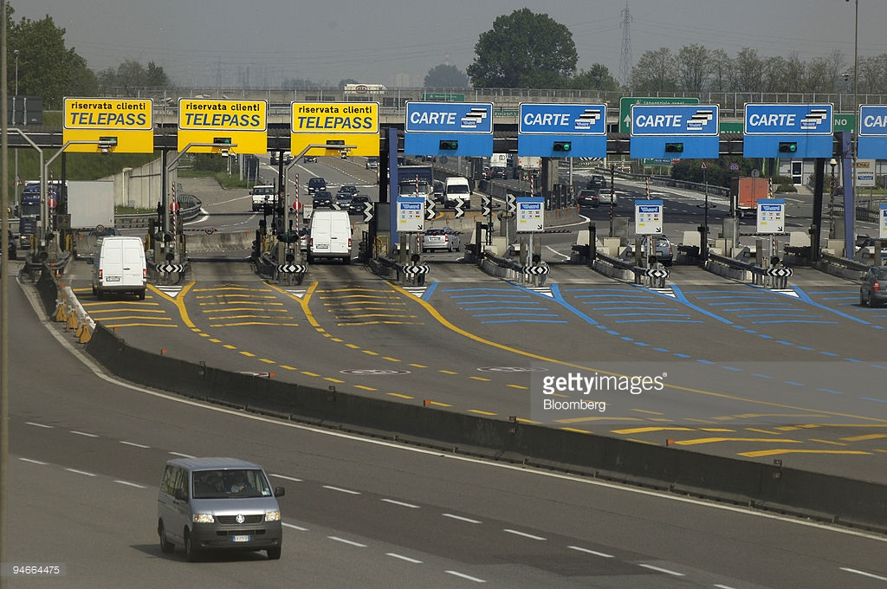

#HSLIDE
### Politecnico di Milano
#### 30.01.2017

#HSLIDE
### VLDB 2016's two paper report
#### Lodi Luca

#HSLIDE
## Selected papers

#VSLIDE
** Effective Indexing for Approximate Constrained Shortest Path Queries on Large Road Networks **

#VSLIDE
** DOCS: Domain-Aware Crowdsourcing System **

#VSLIDE
[Effective Indexing for Approximate Constrained Shortest Path Queries on Large Road Networks - .pdf](http://www.vldb.org/pvldb/vol10/p61-wang.pdf)

#VSLIDE
[DOCS: Domain-Aware Crowdsourcing System - .pdf](http://www.vldb.org/pvldb/vol10/p361-zheng.pdf)

#HSLIDE
### Effective Indexing for Approximate Constrained Shortest Path Queries on Large Road Networks

#HSLIDE
# Who ?

#VSLIDE
- Sibo Wang
  (Nanyang Technological University)
- Xiaokui Xiao
  (Nanyang Technological University)
- Yin Yang
  (Hamad Bin Khalifa University)
- Wenqing Lin
  (Qatar Computing Research Institute)

#HSLIDE
# What ?

#VSLIDE
## CSP query
[**C**onstrainted **S**hortest **P**ath] 

Find path between two nodes that:
- satify a **constraint on cost**
- **minimize length** of path

#VSLIDE
## CSP is NP-HARD

#VSLIDE
## Approximate CSP (&alpha;-CSP)
existing methods are still **prohibitively expensive** on **large Roads Network** (RN).

#VSLIDE
fail to utilize the **special properties of road networks**

#VSLIDE
process queries **without indices** / few existing indices consume **large amounts of memory** in comparison to the limited benefit

#VSLIDE
## COLA
the **first practical solution** for approximate CSP processing on **large road networks**

#VSLIDE

 
 **road network can be effectively partitioned**
  
 *COLA: Optimizing Stream Processing
Applications via Graph Partitioning* (International Federation for Information Processing 2009)

#VSLIDE

 
there exists a **relatively small set of landmark vertices**
that commonly **appear in CSP results**

#VSLIDE

 
Accordingly **indexes the vertices** lying on **partition boundaries**

#VSLIDE

 
on-the-fly algorithm called **&alpha;-Dijk for path computation within a partition**, which **effectively prunes paths** based on landmarks

#VSLIDE

 
On **continent-sized road networks**, COLA answers an approximate CSP query in sub-second time, existing methods can take hours.

#VSLIDE

 
**Without an index**, the **&alpha;-Dijk algorithm** in COLA still **outperforms**
previous solutions by **more than an order of magnitude**.

#HSLIDE
# Why ?

#VSLIDE
## How to deal with multiple criteria on SP ?

#VSLIDE

 

#VSLIDE
## Show multiple path, let the user choose
(Not so efficient)

#VSLIDE

 

#VSLIDE

 

#VSLIDE

 

#VSLIDE

 

#VSLIDE

 
Use **CSP to efficiently solve two-criteria** SP.  
(still **challenging**)

#VSLIDE
Railroads applications
 

#VSLIDE

 
Military applications

#HSLIDE
# State of art

#VSLIDE

### Aim to solve general 	&alpha;-CSP
(no exploitation of graph properties)

#VSLIDE

### None or poor use of indexing
(Few existing indexes are **thought for exact CSP**, thus **memory intensive** without any practical result)

#VSLIDE
### Some concepts:

- &alpha;-dominance
- skyline

#VSLIDE
### Exact CSP without indexing
**Sky-Dijk** stores shortest paths in heaps, for each node

#VSLIDE
### Complexity
O(ℓmaxmn · log(ℓmaxn))

#VSLIDE
### &alpha;-CSP without indexing
**CP-Dijk** is like Sky-Dijk, but removes √n(α)-dominated paths

#VSLIDE
### Complexity
O(κmn · log(κn)) 
κ = log(n · ℓmax/ℓmin)/(α − 1)

#VSLIDE
### Exact CSP with indexing
**CSP-CH** accelerates Sky-Dijk with contraction hierarchies

#VSLIDE
### Contraction hierarchy
- In each iteration removes a vertex from the graph, and substitutes it with new shortcut edges for the remaining vertices
- bidirectional Sky-Dijk search from both the origin s and the destination t simultaneously, utilizing the shortcuts to reduce the number of nodes to be traversed

#VSLIDE
### This index has a prohibitive space complexity
**heuristics** to alleviate this problem:
adding only a set of selected shortcuts, keeping the vertex
 

#VSLIDE

### Its query processing cost is still impractically high
**compromises** dramatically **decrease the effectiveness of the index**

#VSLIDE
### &alpha;-CSP without indexing
**No known literature** about this solution

#VSLIDE
### Other approaches (no state of art)
- ILP problem formulation  (not scalable on large problems)
- k-shortest problem (outperformed by Sky-Dijk)

#HSLIDE
# How ?

#VSLIDE
### The COLA framework
- Graph partitioning
- Overlay graph
- Index (on overlay graph)
- Query processing (exploiting index)
- Various optimizations

#VSLIDE
#### Overlay graph
Overlay graph **compresses the input graph** by:
1. including only the boundary vertices of the partitions and removing all other vertices
2. using edges to represent paths in G
3. reducing the number of edges by removing paths that are &alpha;-dominated by others

#VSLIDE

#VSLIDE

#VSLIDE

 
**q** query from **s** to **t** 
G(q) = G(s) U G(t) U G(o) 
speed up the computation

#VSLIDE
### Constrained Labeling Index

#VSLIDE
2 label sets for each vertex:
- B_in(v): a path from another vertex in G to v
- B_out(v): a path from v to another vertex in G
obtained by **2-hop labeling**

#VSLIDE
To **reduce memory consumption**, in each entry we can **substitute a full path with a tuple** 
**(last vertex, cost,length, second-to-last vertex)** 
index is created through iterations

#VSLIDE

#VSLIDE

 
with the COLA index we do not need to search for the α-
CSP result, but **combine pre-computed paths in the
label** sets to form a result

#VSLIDE
### Query processing
**build** B_out(s) and Bin(t) **during query time**, using the COLA index as well as
subgraphs G(s), G(t) ∈ Partition 
Bout(s) and Bin(t) must satisfy that the α-CSP result can be obtained by concatenating a path from B_out(s) and another from B_in(t)

#VSLIDE
**several nested-loop join operations**, which can be rather **expensive for large label / skyline sets**  
#### Call for optimizations

#VSLIDE

#VSLIDE
**&alpha;-Dijk** is used for:
1. for intra-partition search during query processing in COLA
2. for building the COLA index
3. as a standalone index-free solution for α-CSP

#VSLIDE

 
α-Dijk **concentrates the pruning power to vertices associated with a large number of paths**
 In a real road network, there are usually **a small number of landmark
vertices that appear frequently in CSPs**: concentrating the pruning power
to such vertices leads to **effective reduction of the total number of
paths to be examined**

#VSLIDE

#HSLIDE
# How much ?

#VSLIDE
## Experimental results

#VSLIDE

#VSLIDE

- also **&alpha;-Dijk without indexing outperforms state of the art**
- the results **strictly depends on the distance** between **s** and **t** vertices

#VSLIDE

- cola index is **< 5GB** (affordable)
- overlay network is **an order of magnitude less** than index

#VSLIDE

- cola takes 3x to 4x processing time
- cola's pre-processing cost **< 12 hours** (affordable)

#VSLIDE

- better results with &alpha; >> (prune more paths)
- low sensitivity in query time to &alpha;
